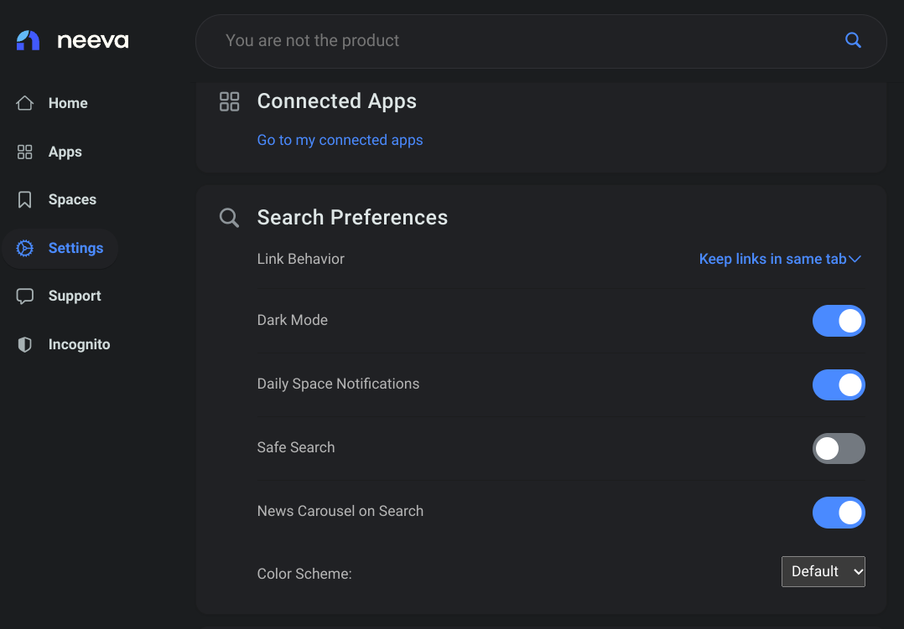
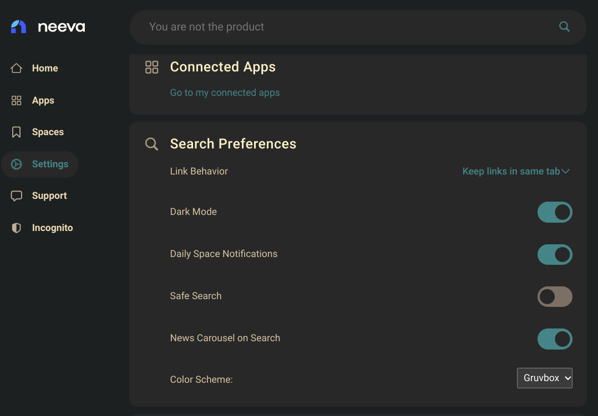

# Neeva Colors

## What is this?

(I'm not associated with the Neeva team.)

Color scheme selection chrome extension for neeva.com.

Currently only has gruvbox as an option - pull requests welcome!

## Examples

### Default

### Gruvbox

## Adding schemes

1. Make a copy of themes/gruvbox.css
2. Replace the copy's colors with your light/dark colors.
3. Add your theme title and key (the 'gruvbox' part of 'gruvbox.css') to SCHEME_TITLES in insertSetting.js
4. Make a pull request
